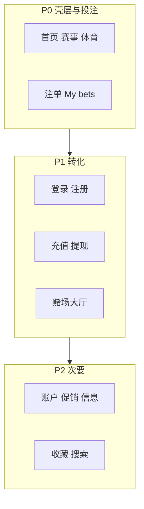

# 桌面站 → 手机视图 UX 审计（≤900px）· 华语版

> 与 Cursor 计划文档同步：`.cursor/plans/mobile_view_ux_audit_zh.md`  
> 英文原版：`.cursor/plans/mobile_view_ux_audit_455ee273.plan.md`

**范围：** 根目录 HTML 页面 + 共享壳层（`css/styles.css`、`css/account.css`、`css/casino.css`、`css/auth-modals.css`、`css/event.css`、`js/script.js`、`js/auth-modals.js`）。不含独立 `mobile/` 站（仅作对照）。重定向占位页 / `404` 降优先级。

**方法：** 基于代码审查布局、导航、触控、投注、转化（登录注册/充值/赌场/促销）、无障碍与空态。设计 token 仍以 [DESIGN_SYSTEM.md](DESIGN_SYSTEM.md) 锁定为准。

**审计地图**

---

## 严重（Critical）

### C1. 左侧体育抽屉无法到达
- **原因：** Sports 底栏使用 `data-mt-flyout-open`；仅在缺少该属性时才会调用 `openLeftDrawer()`（`js/script.js`）。运行时注入的底栏始终带 flyout（`js/auth-modals.js`）。收藏 / `#left-sidebar` 体育列表没有入口。
- **原则：** 连续性 / 找路——主信息架构必须可达。
- **方案：** 保留 flyout 作快捷入口；增加长按、flyout 内「全部体育」、或汉堡菜单区块打开左侧抽屉。`bottom` 与 `tabbar + safe-area` 对齐。
- **更好体验：** Flyout = 快捷；「浏览全部体育」打开完整左侧列表。

### C2. Open 注单空态文案不可见
- **原因：** `@media (max-width: 900px) { .bet-empty-text { display: none } }`（`css/styles.css` 约 6908 行）。History / Guest 已有例外；Open 空态仍用 `.bet-empty-text`（`js/script.js`）。
- **原则：** 反馈——空态必须说明下一步。
- **方案：** 为 `.mybets-empty:not(.mybets-empty--history) .bet-empty-text` 加例外，或 Open 不用该类名。
- **更好体验：** 图标 +「暂无进行中注单」+ 跳转 Sports 的 CTA。

### C3. 充值/提现吸底 CTA 被底栏挡住
- **原因：** `.dep-details-actions { bottom: 0; z-index: 2 }` 对比 `.mobile-tabbar { z-index: 130 }`（`css/account.css`、`css/styles.css`）。
- **原则：** Fitts 定律 / 转化——主 CTA 必须可点。
- **方案：** `bottom: calc(var(--mobile-tabbar-h) + env(safe-area-inset-bottom))`；提高 z-index 或给内容加底内边距。
- **更好体验：** 「继续 / 充值」吸底条始终在底栏上方、清晰可点。

### C4. Multi-LIVE 注单失效
- **原因：** `multi-live.html` 有底栏/侧栏壳，但只有 `js/multi-live.js`，未接入 `script.js` 抽屉逻辑。
- **原则：** 一致性——同一壳层在各体育页行为应一致。
- **方案：** 加载共享注单/抽屉 JS，或把 `openRightDrawer` 移植到 multi-live。
- **更好体验：** 与首页相同的 sheet 行为。

---

## 高（High）

### H1. 赌场 Play/收藏仅悬停可见
- **原因：** 遮罩 `opacity: 0` 直到 `:hover`（`css/casino.css`）；≤900 无触控规则。
- **原则：** 示能——触控没有 hover。
- **方案：** 磁贴上始终显示 Play；或首次点按展开操作。
- **更好体验：** 每张磁贴常驻 Play 芯片 + 心形收藏。

### H2. 赌场左侧栏被移除且无替代
- **原因：** ≤900 `.casino-rail { display: none }`；收藏/促销/筛选消失；桌面赌场未接到分类大厅。
- **原则：** 信息气味 / 可发现性。
- **方案：** 横向 chips，或链到 `casino-categories.html` 模式。
- **更好体验：** 顶栏下吸顶分类 chips。

### H3. 选择赔率总会打开注单
- **原因：** `toggleOdd` 始终调用 `openRightDrawer()`（`js/script.js`）。
- **原则：** 用户控制——不要每次点按都抢走上下文。
- **方案：** 仅首次添加时打开 sheet，或角标 + 可选自动打开设置。
- **更好体验：** Toast「已添加」+ Bet slip 角标脉动；点角标再打开。

### H4. 收藏/搜索/账户有 Bet slip 标签但无 `#right-sidebar`
- **原因：** 体育底栏全局注入；许多页面缺少注单宿主（`favourites.html`、`search.html`、账户页）。
- **原则：** 防错——不要提供死控件。
- **方案：** 这些页加入共享注单片段，或无宿主时隐藏 Bet slip 标签。
- **更好体验：** 全局注单 sheet 组件只挂载一次。

### H5. 注册完成缺少充值 CTA
- **原因：** 完成面板只有「Log In」（`js/auth-modals.js`）。
- **原则：** 转化漏斗——注册后的下一步最佳动作。
- **方案：** 主按钮「立即充值」+ 次按钮「浏览体育」。
- **更好体验：** 成功页一屏展示充值金额 chips。

### H6. 吸顶顶栏缺少 safe-area-top / viewport-fit
- **原因：** `.site-header { top: 0 }` 无 inset；多页缺少 `viewport-fit=cover`。
- **原则：** 平台尊重 / 刘海屏。
- **方案：** 顶栏 `padding-top: env(safe-area-inset-top)`；同步 `--header-h`；需要处补 viewport-fit。
- **更好体验：** 内容永不钻进状态栏。

### H7. 抽屉遮罩在顶栏之下（z-index 90 vs 120）
- **原因：** 「模态」抽屉打开时顶栏仍可交互（`css/styles.css`）。
- **原则：** 模态完整性。
- **方案：** 遮罩 ≥ 顶栏，或压暗顶栏；打开时阻断顶栏点击。
- **更好体验：** 含顶栏在内的清晰遮罩。

### H8. 体育/赌场 flyout 过窄、字号过小
- **原因：** `max-width: 88px`，`font-size: 10px`，padding 2px（`css/styles.css`）。
- **原则：** 触控目标 ≥44×44；可读性。
- **方案：** 更宽面板或底栏 action sheet；标签 12–13px；行高 44px。
- **更好体验：** 从底栏弹出全宽操作表。

### H9. 足球手机赔率 5 列过密
- **原因：** `repeat(5, 1fr)`，标签 9px（`css/styles.css`）。
- **原则：** 投注决策需一眼可读。
- **方案：** 主行 1X2 +「更多盘口」；或两行换行。
- **更好体验：** 大号 1X2；次级盘口展开再看。

### H10. 登录后语言芯片 CSS 冲突
- **原因：** `#header-lang { display: none !important }` 与账户页强制 `.header-meta-group` flex 冲突（`css/styles.css`、`css/account.css`）。挤压钱包/Deposit。
- **原则：** 主转化控件要清晰。
- **方案：** 单一来源：≤900 语言只放完整菜单；勿同时强显两者。
- **更好体验：** 登录后顶栏 = 余额 + Deposit。

---

## 中（Medium）

### M1. Place Bet 在手机上不吸底
- 页脚被设为 `position: static` 以免 Save/load 裁切（`css/styles.css`）→ CTA 随滚动消失。
- **方案：** 吸底页脚 + 注单内部滚动；Save/load 放溢出菜单。
- **更好体验：** Place Bet + 注额常驻可见。

### M2. 注额输入 14px / 高度 30px
- iOS 易触发缩放；触控偏小。
- **方案：** ≤900 字号 ≥16px，控件高度 ≥40px。

### M3. 赛事次级栏 `top: 0` 钻到吸顶顶栏下
- `css/event.css` 与 `--header-h` 不一致。
- **方案：** `top: var(--header-h)`。

### M4. 赛事模式条 `bottom: 70px` 写死
- 与 `--mobile-tabbar-h` + safe-area 不对齐。
- **方案：** 用 token 计算底部偏移。

### M5. 卡片上即时比分层级弱
- 比分与队名权重相近。
- **方案：** 比分更大/更粗；仅比分做 live 脉动。

### M6. 赛事手机看板缺少场馆/阶段细节
- 桌面 Match info 比 `mobileBoardHtml` 更丰富（`js/event.js`）。
- **方案：** 比分下增加紧凑场馆 + 阶段 chips。

### M7. 赔率变动「Confirm」未实现
- 偏好已存；Place 仍只是演示 toast。
- **方案：** 赔率变化时弹出确认 sheet（演示亦可）。

### M8. 认证插图 + 长密码规则把注册 CTA 顶下去
- 社交区固定；主按钮在可滚主体内（`css/auth-modals.css`）。
- **方案：** 主注册按钮吸在社交区上方；规则聚焦前折叠。

### M9. 游戏钱包行在顶栏被隐藏
- 赌场钱包不可见（`css/account.css`）。
- **方案：** 余额芯片打开钱包切换。

### M10. 提现申请表 `min-width: 520px`
- 仅横向滚动；无卡片映射。
- **方案：** ≤900 采用与 `tx-record` 相同的卡片模式。

### M11. 促销卡片到 ≤600 才变列布局
- 601–900 awkward。
- **方案：** 自 900 起用列式卡片。

### M12. 促销筛选缺空态
- 全部卡片可被隐藏且无提示（`js/promo.js`）。
- **方案：** 「暂无促销」+ 清除筛选。

### M13. 赌场网格 4 列 + 搜索过小（≤900）
- 磁贴/标签拥挤。
- **方案：** 2–3 列；搜索高度 ≥44px。

### M14. 赌场/收藏/搜索缺少加载/空/错误态
- 失败时静默。
- **方案：** 共享空态/骨架模块。

### M15. 资料页 Save 不吸底
- 长表单丢失 CTA。
- **方案：** 底栏上方吸底保存条。

### M16. 左抽屉底部忽略 safe-area（对比右侧 sheet）
- 与底栏重叠。
- **方案：** 与右侧 sheet 同一公式。

### M17. 注单 max-height / 双重 safe-area 内边距
- Sheet 可能裁切或过度留白。
- **方案：** 单一 safe-area 归属（sheet 外壳或内容体）。

### M18. 汉堡 `aria-controls="header-bottom"` 但实际菜单是 `#ds-menu-sheet`
- 无障碍不一致（`index.html`、`js/desktop-menu.js`）。
- **方案：** ARIA 指向真实 dialog。

### M19. 搜索赔率仅 toast（未进注单）
- 投注路径断裂（`js/search-page.js`）。
- **方案：** 接 `data-odd` + 共享注单。

### M20. ≤600 隐藏注册 CTA（`.btn-register { display: none }`）
- 小屏转化断崖。
- **方案：** 保留 Register，或在菜单里给「Sign up」同等权重。

### M21. 旧底栏 HTML 闪烁 / FOUC（约 40 页）
- 运行时替换掩盖债务；首屏错误。
- **方案：** 空壳 + `data-sports-tabbar`（参考 favourites/search）。

### M22. TAC 验证：唯一大按钮是客服
- OTP 填满自动前进；成功路径不清晰（`js/auth-modals.js`）。
- **方案：** 明确 Verify 按钮 + 进度。

---

## 低（Low）

### L1. Flyout 遮罩透明（模式信号弱）
### L2. 顶栏控件 32–36px（低于 44px 指引）
### L3. 完整菜单盖住底栏（模态可接受；需够大的关闭热区）
### L4. 赛事信息 z-index 盖过底栏；通知页脚忽略底栏高度
### L5. 首页左抽屉缺少其他体育页已有的关闭控件
### L6. `world-flight-26` 赌场底栏与体育壳不一致

---

## 转化优先级（先修）

| 漏斗 | 问题编号 |
|------|----------|
| **投注** | C2、C4、H3、H4、H9、M1、M2、M7、M19 |
| **充值** | C3、H10、M9 |
| **注册 / 登录** | H5、M8、M20、M22 |
| **赌场** | H1、H2、M13、M14 |
| **促销 / VIP** | M11、M12；VIP 仍埋在账户子导航（登录后可露出 chip） |
| **直播 / 赛事** | M3–M6、H9 |

---

## 建议修复波次（批准后实施）

1. **波次 A — 发布阻断：** C1–C4、H3–H4、H6–H7、H1、C3  
2. **波次 B — 转化：** H5、H2、H9–H10、M1–M2、M8、M20  
3. **波次 C — 打磨：** 其余中/低、底栏 FOUC 空壳、无障碍 ARIA、空态  

**不在范围：** 品牌色板改动、`mobile/` 站对等重写、新视觉识别。

**成功标准（演示向、定性）：** 充值 CTA 永不被底栏挡住；每个 Bet slip 标签都能打开 sheet；加赔率不每次强夺视口；注册成功提供充值入口；赌场 Play 无需 hover 即可点。
